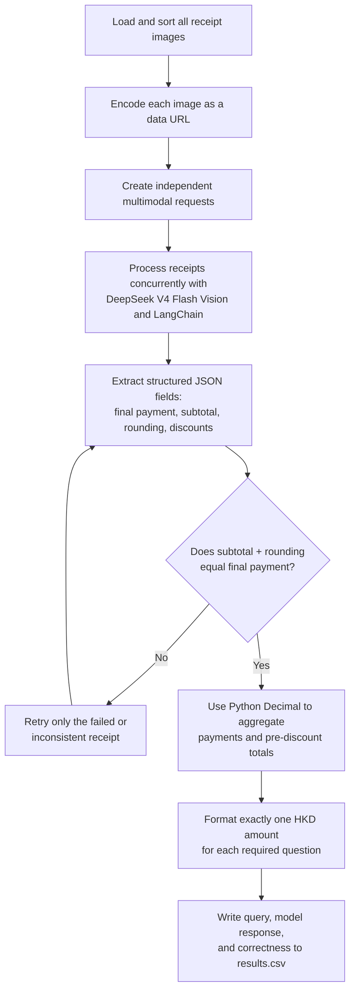

# FTEC5660 Homework 1: Receipt Chain

Build a LangChain pipeline that reads every supermarket receipt in a folder
with the vision-capable DeepSeek Flash model and answers these two questions:

1. How much money did I spend in total for these bills?
2. How much would I have had to pay without the discount?

For this homework, **amount spent** means the final payment after the receipt's
rounding line. **Without the discount** means the sum of the original positive
item prices: add back every promotion, coupon, member, app, packaging-damage,
and percentage discount, but do not add back rounding.

## Student task

Only edit the two functions in `hw1.py` that contain `### YOUR CODE HERE`:

- `build_chain()` creates your LangChain chain.
- `answer_queries()` runs the chain on the receipt images and returns one final
  response for each question.

You may use prompt chaining, routing, parallel calls, reflection, or a
combination. Your final responses should each contain one HKD amount. Do not
hard-code filenames or public answers; grading uses unseen receipt folders.

## Setup and public test

```bash
python3 -m venv .venv
source .venv/bin/activate
pip install -r requirements.txt
```

Put your DeepSeek key after `DEEPSEEK_API_KEY=` in `.env`, then run:

```bash
python3 hw1.py --image-folder public_test
```

The program creates `results.csv` in the current directory. Its columns are
`query`, `model_response`, and `correctness`. The public answers are in
`public_test/ground_truth.json`. The starter intentionally returns the dummy
response `please design your chain to answer these two queries.` so it runs
before you add any API code.

The required model is `deepseek-v4-flash-vision-exp`, the vision-capable
DeepSeek Flash model. JPEG, PNG, GIF, and WebP inputs are accepted by the
homework runner.


## Homework 1 solution

### Chain design



### Solution description

The solution uses LangChain with `deepseek-v4-flash-vision-exp` to process
each supermarket receipt as an independent multimodal request. The prompt asks
the model to return structured JSON containing the final payment after
rounding, the subtotal before rounding, the rounding adjustment, and every
eligible discount amount. Independent receipts are processed concurrently to
reduce end-to-end latency. After extraction, the program performs a
deterministic consistency check by verifying that the subtotal plus the
rounding adjustment equals the final payment; only a failed or inconsistent
receipt is retried. The two folder-level answers are then calculated with
Python `Decimal` arithmetic instead of relying on the language model for
addition, which avoids floating-point errors and makes the aggregation easier
to verify. Finally, each response is formatted as exactly one HKD amount so it
can be evaluated reliably by the provided scoring script.
